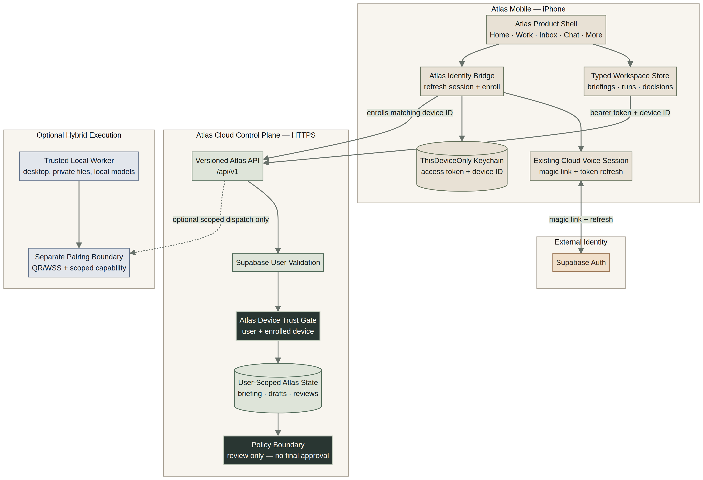

# Alphonso Full-Mobile Foundation

## Purpose

The iOS application now has a new default product shell named **Atlas**. Atlas is the first implementation of Alphonso as a full mobile ecosystem client. It replaces the legacy companion-first navigation with **Home, Work, Inbox, Chat, and More** while the existing companion remains available as a reversible compatibility mode. Selecting a Work ledger entry opens a native **Work record** with the run’s purpose, owner, phase, verified update time, accountable next step, immutable trace, and—only when the authoritative briefing relates one—the decision/evidence checkpoint. The native Create work sheet holds its user in a clear preparation state, presents an explicit prepared-work receipt before leaving the sheet, and provides retryable local error feedback. A prepared record is a planned run only; it does not execute a task.

This is deliberately a migration seam, not a claim of backend parity. Atlas now renders through typed workspace, briefing, run, decision, and outcome models backed by an async fixture repository. The repository conforms to the same contract the future Cloud control-plane client will use, allowing the information architecture, accessibility patterns, state handling, and design system to be validated on device before live API connectivity is introduced.

## Source layout

| Path | Responsibility |
|---|---|
| `Foundation/AtlasDesignSystem.swift` | Semantic tokens, Dynamic Type roles, execution posture, status labels, and reusable Atlas components. |
| `Atlas/AtlasMobileRoot.swift` | Atlas navigation and store-driven Home/Work/Inbox/Chat/More screens, focused decision review, and create-work sheet. |
| `Atlas/AtlasDomain.swift` | Typed Workspace, Briefing, Run, Decision, and Outcome models; async repository protocol; fixture repository; observable workspace store. |
| `Atlas/AtlasCloudRepository.swift` | Versioned HTTPS v1 client, `ThisDeviceOnly` Keychain token/device-ID providers, transport seam, response DTOs, typed error mapping, and fixture-aware repository factory. |
| `Atlas/AtlasIdentityService.swift` | Shared Cloud Voice session handoff, refreshed-token mirroring, Atlas device enrollment client, observable device-trust state, and typed Account & Cloud presentation state. |
| `ContentView.swift` | Reversible `@AppStorage` migration switch between Atlas and the legacy local companion. |
| `AlphonsoCompanionUITests/AlphonsoCompanionUITests.swift` | Smoke coverage for the Atlas default experience and the legacy return path. |

## Migration contract

The legacy implementation remains structurally isolated and is selected with the `alphonso.mobile.experience` application preference. Atlas is the default. The **More → Open legacy companion** action intentionally preserves access to the old local pairing workflow until the new typed Hybrid worker protocol has been implemented and verified.

No new product work should be added directly to `WebSocketService` or the seven-tab legacy `TabView`. New mobile capability should target Atlas and extend `AtlasWorkspaceRepository` through versioned, typed control-plane contracts once available.

## Cloud control-plane configuration

Atlas remains fixture-backed by default. A build activates the Cloud repository only when `AtlasControlPlaneURL` is set to a valid HTTPS origin in `Info.plist` or build configuration. `AtlasControlPlaneAPIVersion` defaults to `v1`. Access tokens are read from a dedicated Keychain entry (`com.alphonso.mobile.controlPlane` / `access-token`); they are not reused from Voice Cloud and are never stored in `UserDefaults`.

| v1 operation | Request | Expected response |
|---|---|---|
| Enroll device | `POST /api/v1/devices/enroll` | Matching `X-Alphonso-Device-Id` header/body pair; returns a device-trust receipt. |
| Workspace briefing | `GET /api/v1/workspaces/{workspace_id}/briefing` | Requires bearer token and enrolled device; returns typed workspace, freshness, active runs, outcomes, decisions, and refresh timestamp. |
| Live workspace feed | `GET /api/v1/workspaces/{workspace_id}/events` | Authenticated server-sent events. The first event is `workspace.snapshot`; each follow-on event contains a complete authoritative briefing for store reconciliation. |
| Audit receipts | `GET /api/v1/workspaces/{workspace_id}/audit-receipts` | Read-only, user/workspace-scoped records for review, challenge, and confirmation. Every current receipt reports `not_executed`. The Atlas mobile entry lives in **More → Security & Devices**. |
| Create draft work | `POST /api/v1/workspaces/{workspace_id}/runs/drafts` | Typed run, with snake-case `execution_posture` in the request. |
| Record decision review | `POST /api/v1/workspaces/{workspace_id}/decisions/{decision_id}/reviews` | Typed review state. It is neither an approval nor a challenge issuance endpoint. |
| Issue confirmation challenge | `POST /api/v1/workspaces/{workspace_id}/decisions/{decision_id}/action-challenges` | Requires recorded review and returns a short-lived, device-bound challenge statement. |
| Record challenged confirmation | `POST /api/v1/workspaces/{workspace_id}/decisions/{decision_id}/action-confirmations` | Requires the matching challenge and local-authentication attestation. Returns `confirmation_recorded` and `not_executed`; it does not trigger an external action. |

The client sends `Authorization: Bearer <access-token>`, `X-Alphonso-Device-Id`, `X-Alphonso-Client: ios`, and `X-Alphonso-API-Version: v1` on every workspace request. The Atlas identity bridge refreshes the existing user session, mirrors the short-lived access token into an Atlas-specific `ThisDeviceOnly` Keychain entry, and enrolls the matching device ID before the typed workspace store loads. After enrollment, the store opens the authenticated event feed and reconciles only complete server-authoritative briefings; it does not apply partial stream mutations. High-risk decisions now follow a separate sequence: record review, request the server challenge, complete Face ID locally, and submit a confirmation receipt. The current demo receipt remains explicitly non-executing; production approval still requires a server-verifiable biometric proof and a distinct policy-gated execution adapter. The mobile audit screen loads this receipt feed separately from the workspace briefing, reports unavailability without blocking core work, and intentionally renders an empty state in fixture-backed builds rather than inventing audit history.

## Architecture visual

The diagram source is maintained in `atlas-mobile-ecosystem-architecture.mmd`. It separates the full mobile product shell, secure identity and Keychain boundary, HTTPS control plane, optional Hybrid worker, and external authentication provider. The durable storage and audit design is documented in [Atlas Persistence Foundation](atlas-persistence-foundation.md).

## Planned replacement of fixture-backed state

| Atlas surface | Current foundation source | Target contract |
|---|---|---|
| Account & Cloud | Read-only Account & Cloud screen with safe reconnect of the existing authenticated session, Cloud configuration status, and device-trust state | Dedicated Atlas sign-in/session UI, explicit account management, durable device enrollment/revocation, and a device-bound session policy. |
| Device trust | `AtlasIdentityService`, existing Cloud Voice session, and Atlas-specific Keychain device ID | `POST /api/v1/devices/enroll`, durable device enrollment/revocation, and a device-bound session policy. |
| Workspace ribbon | `AtlasWorkspaceStore` via a factory that falls back to `AtlasFixtureRepository` when Cloud is unconfigured | `WorkspaceSummary` plus health and execution-posture events. |
| Home | `AtlasBriefing` and correlated `AtlasRun`/`AtlasOutcome` records | `GET /v1/workspaces/{id}/briefing` and typed briefing events. |
| Work ledger | Typed `AtlasRun` phase records plus a derived, read-only Work record from the current briefing | `GET /v1/runs`, a correlated run event stream, and a typed per-run detail/artifact contract before richer evidence is claimed. |
| Create work | Local typed preparation operation with preparing/prepared/failed states and a user-visible draft receipt | Durable idempotency key, server-signed creation receipt, offline retry queue, and explicit policy validation before any queued workload begins. |
| Inbox decision | Typed `AtlasDecision` state and review handoff | `GET /v1/decisions` plus server-issued action challenge/receipt. |
| Chat Studio | Typed workspace and decision context | Conversation/run API with structured event blocks and attachment transfer. |
| Local Worker | Legacy direct pairing remains available | QR/WSS device-bound worker registration and scoped Hybrid work dispatch. |

## Non-negotiable implementation rules

Atlas components use semantic design tokens and Dynamic Type rather than raw feature-level colours, fixed body font sizes, or decorative agent-card presentation. Every future run, decision, message, and account state must display execution posture, freshness, and a recovery path when those concepts apply. Account recovery must never display credentials, raw device IDs, or imply that reconnecting enables final execution.

A client-side UI state is never proof that a sensitive action happened. Approval, cancellation, Connector actions, and Hybrid worker dispatch must be confirmed by the control plane and recorded as an auditable receipt before Atlas presents a completed state.
